<h2>TensorFlow-FlexUNet-Image-Segmentation-Laparoscopic-Image (2026/09/29)</h2>
Sarah T.  Arai 
Software Laboratory antillia.com  
This is the first experiment of Image Segmentation for <b>Laparoscopic Image</b> 
</a> based on our <a href="https://github.com/sarah-antillia/TensorFlow-FlexUNet-Image-Segmentation-Model">
TensorFlow-FlexUNet-Image-Segmentation-Model</a> 
(TensorFlow Flexible UNet Image Segmentation Model for Multiclass) , 
and a PNG
<a href="https://drive.google.com/file/d/1N353iaF7Ieo_dWHEUU87imGx7_xKdLCD/view?usp=sharing">
<b>Augmented-Laparoscopic-ImageMask-Dataset.zip</b></a> (<a href="https://creativecommons.org/licenses/by-nc/4.0/">CC BY-NC 4.0</a>) 
which was derived by us from the Kaggle   
<a href="https://www.kaggle.com/datasets/salmanmaq/m2caiseg">
 <b>m2caiSeg
</b></a> <b>Semantic Segmentation of Laparoscopic Images</b> 
by SalmanMaqbool.
   

<b>Actual Image Segmentation for Laparoscopic Image </b> 
As shown below, the inferred masks predicted by our segmentation are somewhat similar to the ground truth masks, 
but differ in the details.
  
<table>
<tr>
<th>Input: image</th>
<th>Mask (ground_truth)</th>
<th>Prediction: inferred_mask</th>
</tr>
<tr>
<td>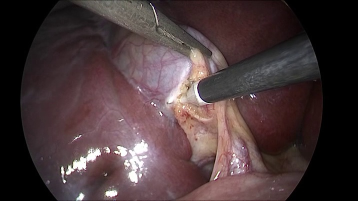</td>
<td></td>
<td></td>
</tr>
<tr>
<td>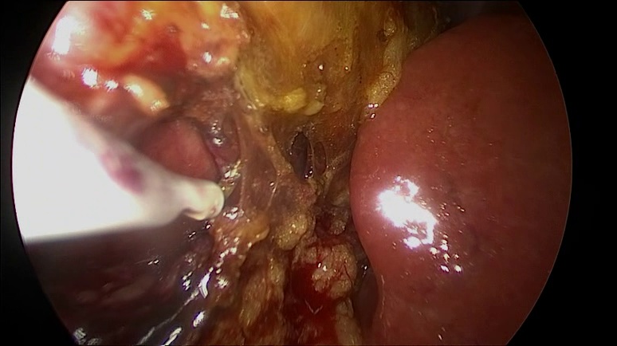</td>
<td>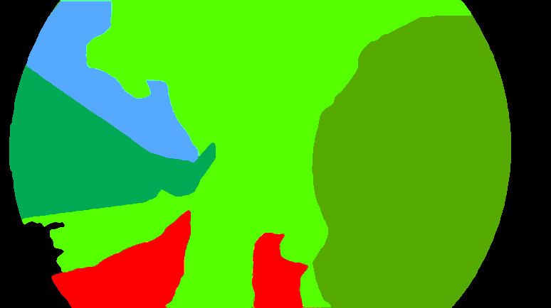</td>
<td>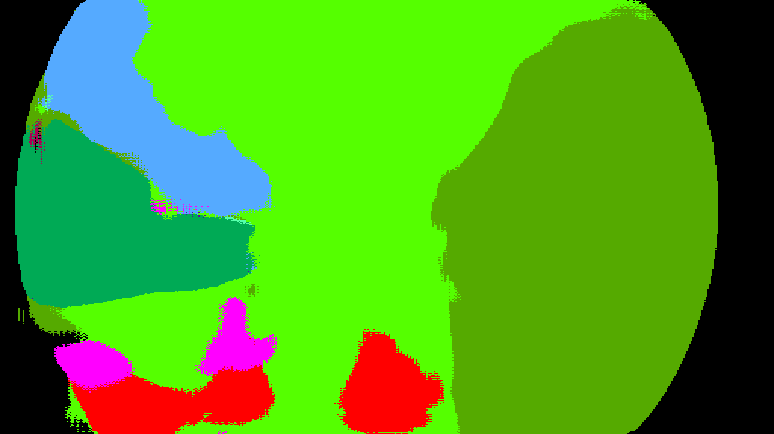</td>
</tr>
<tr>
<td>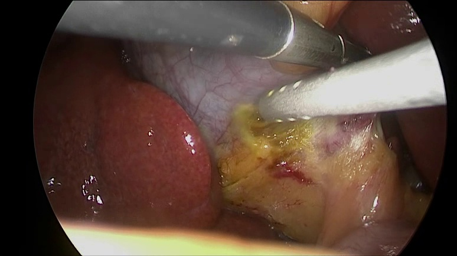</td>
<td>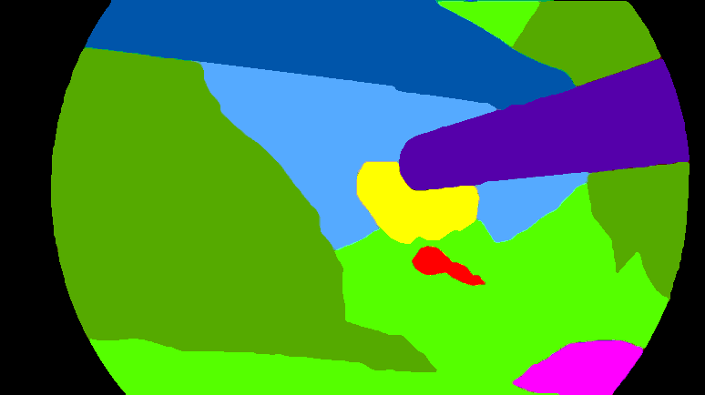</td>
<td></td>
</tr>
</table>

 
<b>class_color_mapping_table</b>  
<table border=1 style='border-collapse:collapse;' cellpadding='5'>
<tr><th>Indexed Color</th><th>Color</th><th>RGB</th><th>Class</th></tr>
<tr><td>0</td><td with='80' height='auto'></td><td>(0, 0, 0)</td><td>background</td></tr>
<tr><td>1</td><td with='80' height='auto'></td><td>(170, 170, 170)</td><td>class_1</td></tr>
<tr><td>2</td><td with='80' height='auto'></td><td>(255, 255, 0)</td><td>class_2</td></tr>
<tr><td>3</td><td with='80' height='auto'></td><td>(0, 85, 255)</td><td>class_3</td></tr>
<tr><td>4</td><td with='80' height='auto'></td><td>(0, 170, 85)</td><td>class_4</td></tr>
<tr><td>5</td><td with='80' height='auto'></td><td>(85, 170, 170)</td><td>class_5</td></tr>
<tr><td>6</td><td with='80' height='auto'></td><td>(85, 0, 170)</td><td>class_6</td></tr>
<tr><td>7</td><td with='80' height='auto'></td><td>(170, 85, 0)</td><td>class_7</td></tr>
<tr><td>8</td><td with='80' height='auto'></td><td>(0, 85, 170)</td><td>class_8</td></tr>
<tr><td>9</td><td with='80' height='auto'></td><td>(170, 0, 85)</td><td>class_9</td></tr>
<tr><td>10</td><td with='80' height='auto'></td><td>(255, 0, 0)</td><td>class_10</td></tr>
<tr><td>11</td><td with='80' height='auto'></td><td>(85, 170, 85)</td><td>class_11</td></tr>
<tr><td>12</td><td with='80' height='auto'></td><td>(85, 170, 255)</td><td>class_12</td></tr>
<tr><td>13</td><td with='80' height='auto'></td><td>(85, 255, 0)</td><td>class_13</td></tr>
<tr><td>14</td><td with='80' height='auto'></td><td>(85, 255, 170)</td><td>class_14</td></tr>
<tr><td>15</td><td with='80' height='auto'></td><td>(85, 170, 0)</td><td>class_15</td></tr>
<tr><td>16</td><td with='80' height='auto'></td><td>(255, 0, 255)</td><td>class_16</td></tr>
</table>
 
 
<h3>1.  Dataset Citation</h3>
The dataset used here was derived from   
<a href="https://www.kaggle.com/datasets/salmanmaq/m2caiseg">
 <b>m2caiSeg
</b></a> <b>Semantic Segmentation of Laparoscopic Images</b> 
by SalmanMaqbool.
   
The following explanation (excerpt) was taken from the website above.
  
<b>About Dataset</b> 
<b>Context</b> 
This is the dataset associated with our research paper 
<a href="https://arxiv.org/pdf/2008.10134">
m2caiSeg: Semantic Segmentation of Laparoscopic Images using Convolutional Neural Networks
</a> 
If you use this dataset in your work, kindly do cite our paper 
<pre>
@article{maqbool2020m2caiseg,
  title={m2caiSeg: Semantic Segmentation of Laparoscopic Images using Convolutional Neural Networks},
  author={Maqbool, Salman and Riaz, Aqsa and Sajid, Hasan and Hasan, Osman},
  journal={arXiv preprint arXiv:2008.10134},
  year={2020}
}
</pre>
 
<b>Content</b> 
There are three directories, each of which contains two sub-directories ("images" and "groundtruth"):  
1.trainval: Contains all the images and their respective ground-truth segmentation masks. 
We encourage you to randomly sample from this rather than relying on our provided train and test sets used in the paper. 
2. train: Contains the images and their respective ground-truth segmentation masks we used in our afore-mentioned paper
 for training 
3. test: Contains the images and their respective ground-truth segmentation masks we used in our afore-mentioned paper 
for testing and reporting of any metrics.
  
<b>License</b> 
<a href="https://creativecommons.org/licenses/by-nc/4.0/">CC BY-NC 4.0</a>
 
 
<h3>
2. Laparoscopic-Image ImageMask Dataset
</h3>
<h3>
2.1 Download ImageMask Dataset
</h3>
 If you would like to train this Laparoscopic-Image Segmentation model,
please down load our dataset <a href=https://drive.google.com/file/d/1N353iaF7Ieo_dWHEUU87imGx7_xKdLCD/view?usp=sharing"">
<b>Augmented-Laparoscopic-ImageMask-Dataset.zip</b>
</a> (<a href="https://creativecommons.org/licenses/by-nc/4.0/">CC BY-NC 4.0</a>)) on Google Drive.
Expand the downloaded, and put it under <b>./dataset/</b> to be.
<pre>
./dataset
└─Laparoscopic-Image
    ├─test
    │   ├─images
    │   └─masks
    ├─train
    │   ├─images
    │   └─masks
    └─valid
         ├─images
         └─masks
</pre>
 
<b>Laparoscopic-Image Statistics</b> 
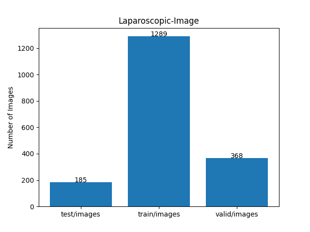 
 
As shown above, the number of images of train and valid datasets is large enough to use as the training set for our segmentation model.
  
<h3>
2.2 Train Sample Images and Masks
</h3>
<b>Train_sample images</b> 
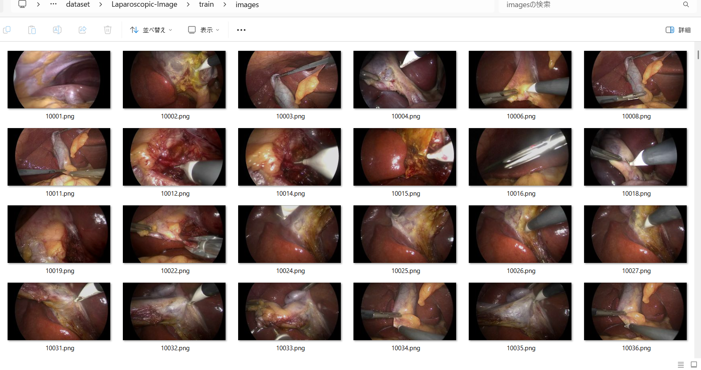
 
<b>Train_sample_masks</b> 
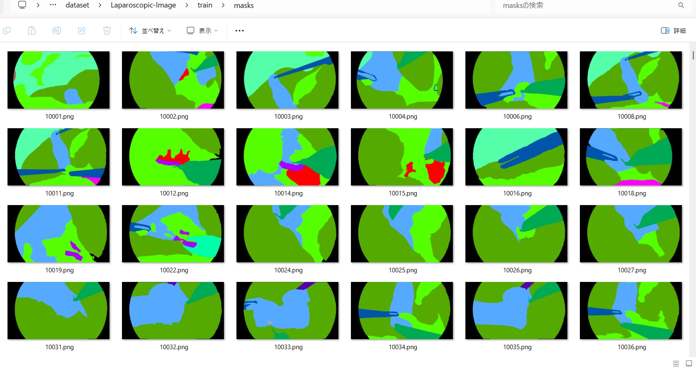
 
<h3>
3. Train TensorFlowFlexUNet Model
</h3>
 We trained Laparoscopic-Image TensorflowFlexUNet Model by using the following
<a href="./projects/TensorFlowFlexUNet/Laparoscopic-Image/train_eval_infer.config"> <b>train_eval_infer.config</b></a> file.  
Please move to ./projects/TensorFlowFlexUNet/Laparoscopic-Image and run the following bat file. 
<pre>
>1.train.bat
</pre>
This simply runs the following command. 
<pre>
>python ../../../src/TensorFlowFlexUNetTrainer.py ./train_eval_infer.config
</pre>

<b>Model parameters</b> 
Defined a small <b>base_filters=16</b> and a large <b>base_kernels=(11,11)</b> for the first Conv Layer of Encoder Block of 
<a href="./src/TensorFlowFlexUNet.py">TensorFlowFlexUNet.py</a> 
and a <b>large num_layers=8</b> (including a bridge between Encoder and Decoder Blocks).
<pre>
[model]
image_width    = 512
image_height   = 512
image_channels = 3
input_normalize = True
normalization  = False
num_classes    = 17
base_filters   = 16
base_kernels  = (11,11)
num_layers    = 8
dropout_rate   = 0.04
dilation       = (3,3)
</pre>

<b>Learning rate</b> 
Defined a small learning rate.  
<pre>
[model]
learning_rate  = 0.00007
</pre>

<b>Loss and metrics functions</b> 
Specified "categorical_crossentropy" and "dice_coef_multiclass". 
<pre>
[model]
loss           = "categorical_crossentropy"
metrics        = ["dice_coef_multiclass"]
</pre>
<b >Learning rate reducer callback</b> 
Enabled the learning_rate_reducer callback and a small reducer_patience.
<pre> 
[train]
learning_rate_reducer = True
reducer_factor     = 0.4
reducer_patience   = 4
</pre>
<b>Early stopping callback</b> 
Enabled early stopping callback with patience parameter.
<pre>
[train]
patience      = 10
</pre>
<b></b> 
<b>RGB color map</b> 
RGB color map dict for Laparoscopic-Image 1+16 classes. 
<pre>
[mask]
mask_file_format = ".png"
; Laparoscopic-Image 1+16
; 
rgb_map={(0, 0, 0):0,(170, 170, 170):1, (255, 255, 0):2, (0, 85, 255):3, (0, 170, 85):4, (85, 170, 170):5, \
    (85, 0, 170):6, (170, 85, 0):7, (0, 85, 170):8,(170, 0, 85):9, (255, 0, 0):10, (85, 170, 85):11, (85, 170, 255):12,\
    (85, 255, 0):13, (85, 255, 170):14, (85, 170, 0):15, (255, 0, 255):16}

</pre>
<b>Epoch change inference callbacks</b> 
Enabled epoch_change_infer callback. 
<pre>
[train]
epoch_change_infer       = True
epoch_change_infer_dir   =  "./epoch_change_infer"
epoch_changeinfer        = False
epoch_changeinfer_dir    = "./epoch_changeinfer"
num_infer_images         = 6
</pre>
By using this epoch_change_infer callback, on every epoch_change, the inference procedure can be called
 for 6 images in <b>mini_test</b> folder. This will help you confirm how the predicted mask changes 
 at each epoch during your training process.    
<b>Epoch_change_inference output at starting (1,2,3)</b> 
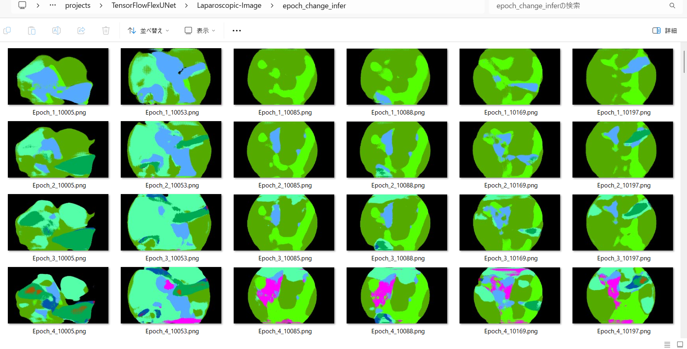 
 
<b>Epoch_change_inference output at middle-point (23,24,25)</b> 
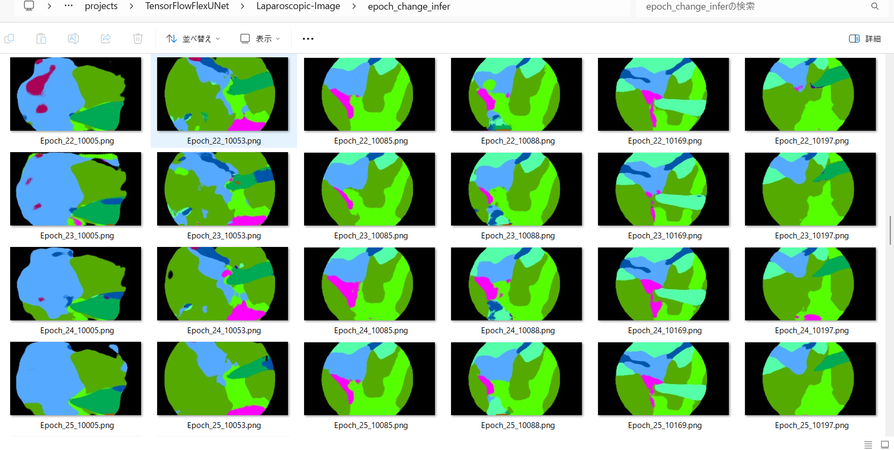 
 
<b>Epoch_change_inference output at ending (48,49,50)</b> 
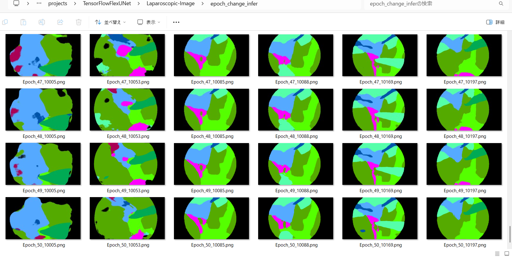 

 
In this experiment, the training process was terminated at epoch 50.  
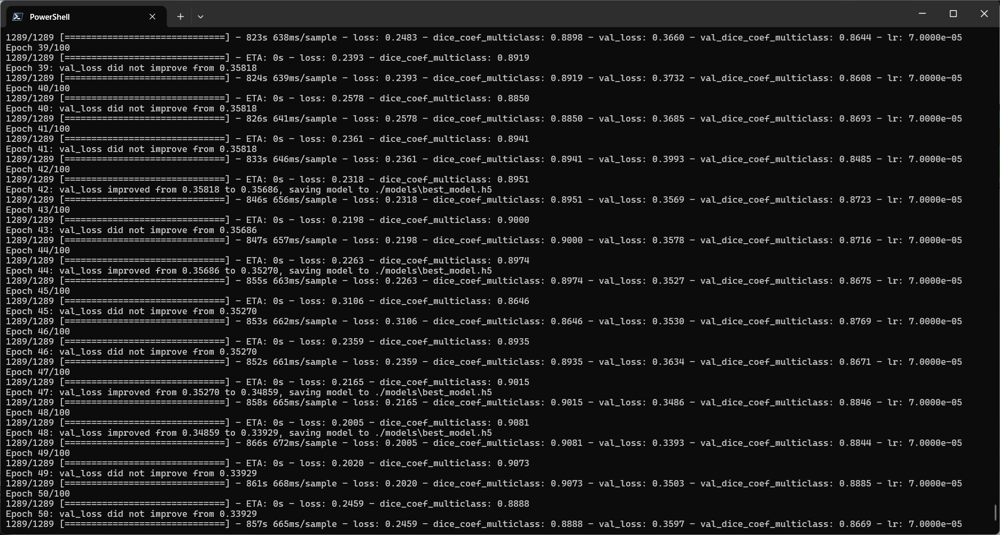 
 
<a href="./projects/TensorFlowFlexUNet/Laparoscopic-Image/eval/train_metrics.csv">train_metrics.csv</a> 
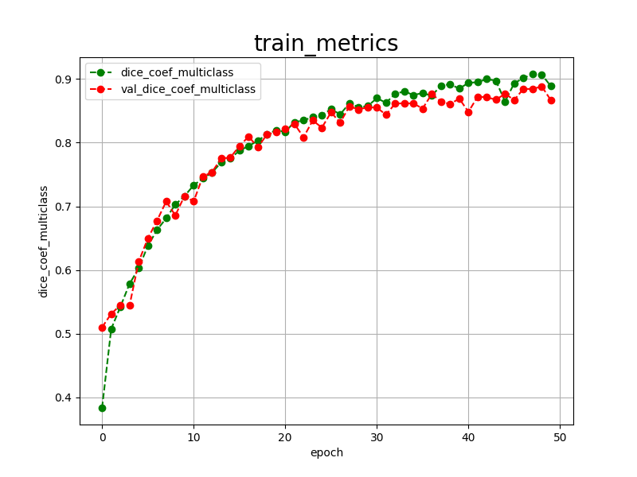 

 
<a href="./projects/TensorFlowFlexUNet/Laparoscopic-Image/eval/train_losses.csv">train_losses.csv</a> 
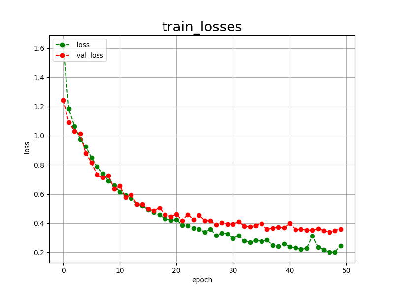 
 
<h3>
4. Evaluation
</h3>
Please move to <b>./projects/TensorFlowFlexUNet/Laparoscopic-Image</b> folder,
and run the following bat file to evaluate the TensorFlowFlexUNet model for Laparoscopic-Image. 
<pre>
>./2.evaluate.bat
</pre>
This simply runs the following command.
<pre>
>python ../../../src/TensorFlowFlexUNetEvaluator.py  ./train_eval_infer.config
</pre>
Evaluation console output: 
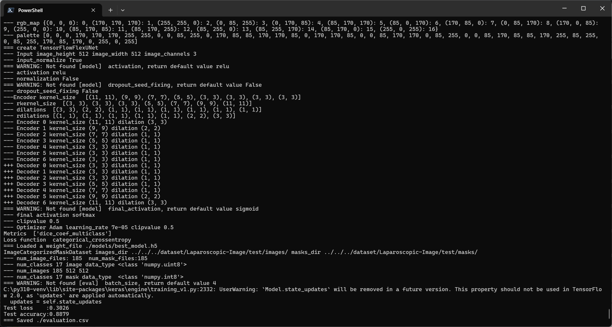
  Image-Segmentation-Laparoscopic-Image

<a href="./projects/TensorFlowFlexUNet/Laparoscopic-Image/evaluation.csv">evaluation.csv</a> 
The loss (categorical_crossentropy) and dice_coef_multiclass for this <b>Laparoscopic-Image/test</b> were bad, as shown below.
 
<pre>
categorical_crossentropy,0.3026
dice_coef_multiclass,0.8879
</pre>
 
<h3>5. Inference</h3>
Please move to <b>./projects/TensorFlowFlexUNet/Laparoscopic-Image</b> folder
and run the following bat file to infer segmentation regions for images using the trained TensorFlowFlexUNet model 
for Laparoscopic-Image. 
<pre>
>./3.infer.bat
</pre>
This simply runs the following command.
<pre>
>python ../../../src/TensorFlowFlexUNetInferencer.py ./train_eval_infer.config
</pre>

<b>mini_test_images</b> 
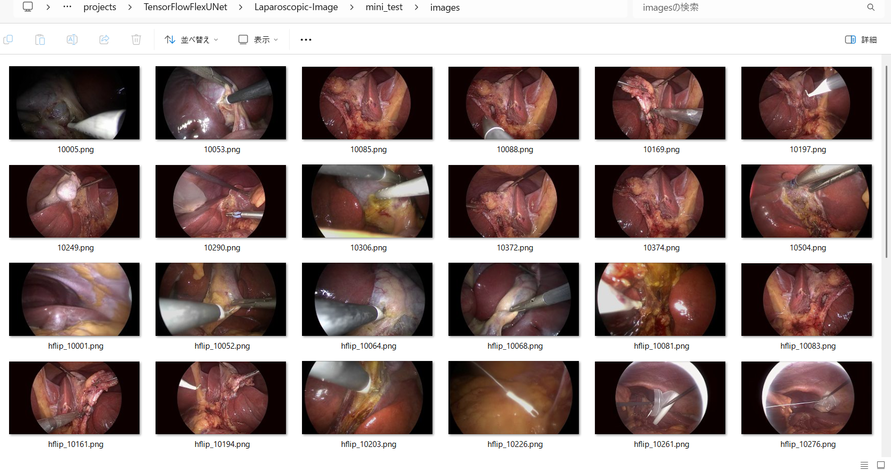 
<b>mini_test_mask(ground_truth)</b> 
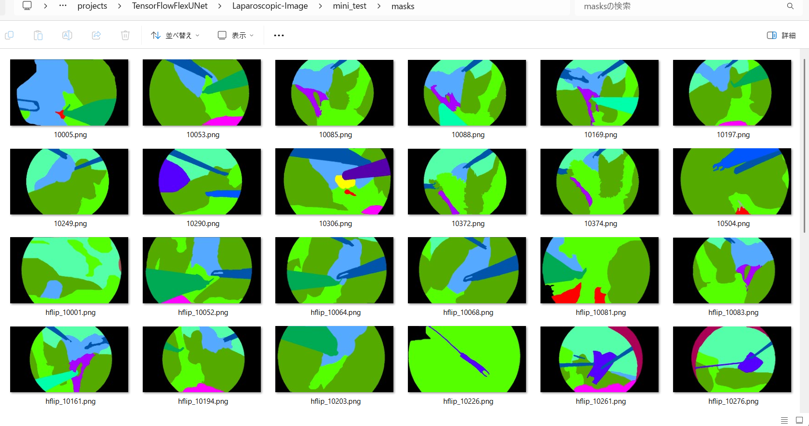 

<b>Inferred test masks</b> 
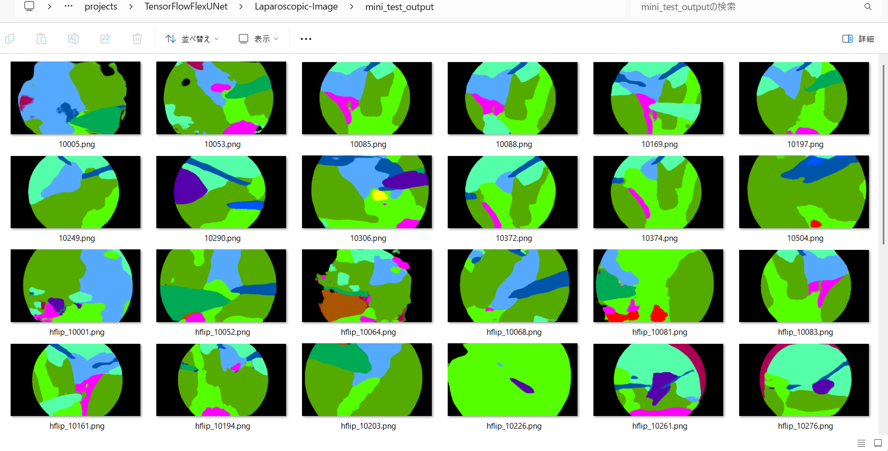 
 

<b>Enlarged images and masks for Laparoscopic Image</b> 
As shown below, the inferred masks predicted by our segmentation are somewhat similar to the ground truth masks, 
but differ in the details.
 
 
<table>
<tr>
<th>Input: image</th>
<th>Mask (ground_truth)</th>
<th>Prediction: inferred_mask</th>
</tr>
<tr>
<td>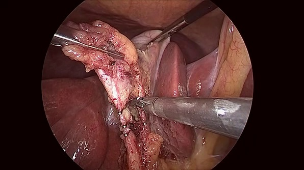</td>
<td></td>
<td></td>
</tr>

<tr>
<td>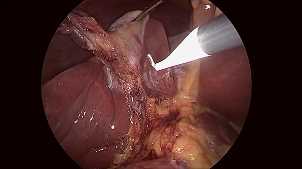</td>
<td></td>
<td></td>
</tr>

<tr>
<td>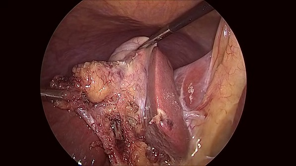</td>
<td></td>
<td></td>
</tr>
<tr>
<td></td>
<td></td>
<td></td>
</tr>
<tr>
<td>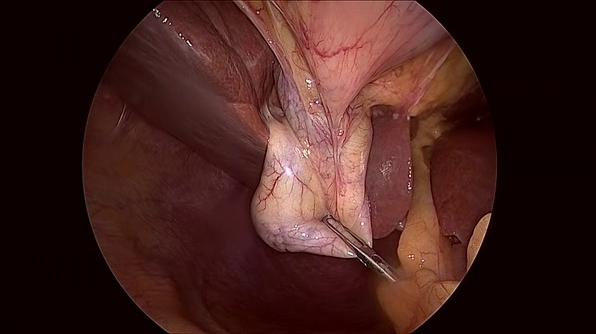</td>
<td></td>
<td></td>
</tr>
<tr>
<td>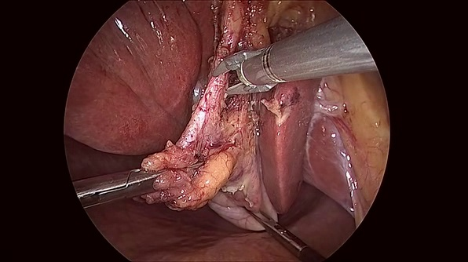</td>
<td></td>
<td></td>
</tr>
</table>

 
<h3>
References
</h3>
<b>1. Laparoscopy</b> 
<a href="https://en.wikipedia.org/wiki/Laparoscopy">
https://en.wikipedia.org/wiki/Laparoscopy
</a>
  
<b>2. m2caiSeg: Semantic Segmentation of Laparoscopic Images
using Convolutional Neural Networks</b> 
Salman Maqbool, Aqsa Riaz, Hasan Sajid, Osman Hasan 
<a href="https://arxiv.org/pdf/2008.10134">
https://arxiv.org/pdf/2008.10134
</a>
  
<b>3. m2caiseg </b> 
MengzhangLi 
<a href="https://github.com/openmedlab/Awesome-Medical-Dataset/blob/main/resources/m2caiseg.md">
https://github.com/openmedlab/Awesome-Medical-Dataset/blob/main/resources/m2caiseg.md</a>
  
<b>3. TensorFlow-FlexUNet-Image-Segmentation-Laparoscopic-Cholecystectomy-Cholec80</b> 
Toshiyuki Arai  
<a href="https://github.com/sarah-antillia/TensorFlow-FlexUNet-Image-Segmentation-Laparoscopic-Cholecystectomy-Cholec80">
https://github.com/sarah-antillia/TensorFlow-FlexUNet-Image-Segmentation-Laparoscopic-Cholecystectomy-Cholec80
</a>
  
<b>4. TensorFlow-FlexUNet-Image-Segmentation-Model</b> 
Toshiyuki Arai  
<a href="https://github.com/sarah-antillia/TensorFlow-FlexUNet-Image-Segmentation-Model">
https://github.com/sarah-antillia/TensorFlow-FlexUNet-Image-Segmentation-Model</a>
 
 
